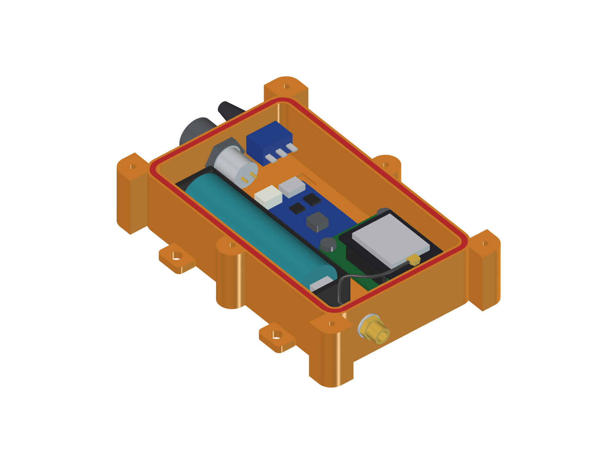
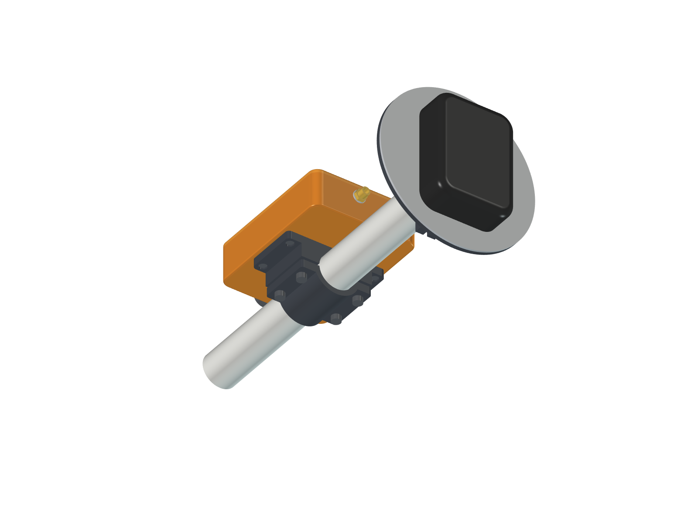

# RTK Rover Enclosure — simpleRTK2B Micro breakout + 18650

Water-resistant 3D-printed box for a portable RTK GNSS rover:

* **WildBuckwheat simpleRTK2B Micro breakout board v2.1** with an ArduSimple
  simpleRTK2B Micro (u-blox ZED-F9P) plugged into it and an HC-05 Bluetooth
  module on the back
* **internal 18650 cell** in a holder, with a charger/boost module
* **SMA bulkhead** on the end wall, fed by a pigtail from the Micro's own
  edge-mount **SMA** (default) or U.FL (`micro_ant`)
* sealed power switch and capped charging connector
* smooth outside: the six lid-screw pillars are inside the shell, outside edges filleted
* two-part clamp that fixes the back face to a PVC pipe / pole
* the breakout's own micro-USB is inside the box (see *Micro-USB* below)

Everything is generated by `rtk_enclosure.py` (CadQuery). The ready-to-print
files and the drawings live in `out/`.

| File | What |
|------|------|
| `out/rtk_enclosure_base.stl` / `.step` | base, print as-is (open side up) |
| `out/rtk_enclosure_lid.stl` / `.step` | lid; the STL is already flipped so the flat top is on the bed |
| `out/plan_z11.png` | plan view at mid height: wall holes, standoffs, component keep-outs |
| `out/plan_z0.png` | floor: battery and module bay ribs, clamp-screw bosses |
| `out/pipe_clamp_saddle_od*.stl`, `out/pipe_clamp_cap_od*.stl` / `.step` | pipe clamp, one pair per pipe size (see *Pipe clamp*) |
| `out/plan_groove.png` | gasket groove and screw pillars |
| `out/wall_plusX.png`, `out/wall_minusX.png` | the two end walls |
| `out/side_section.png` | long section through battery bay, SMA jack and lid |
| `out/lid_plate.png`, `out/lid_lip.png` | lid: screw holes, LED windows, locating lip |

## Assembly model and renders



`rtk_assembly.py` places mocked-up internals in the box and writes a coloured
STEP assembly with one named part per component; `render_freecad.py` turns that
into shaded PNGs inside FreeCAD.

| File | What |
|------|------|
| `out/rtk_rover_assembly.step` | base, lid, gasket, screws and all mock components, coloured and named. In FreeCAD open it through the GUI (File > Open, or `ImportGui.insert`); the non-GUI `Import.insert` drops the colours |
| `out/render_open_sma_end.png`, `out/render_open_switch_end.png`, `out/render_open_top.png` | lid off |
| `out/render_closed_sma_end.png`, `out/render_closed_switch_end.png` | closed box on the pipe, both ends |
| `out/render_back_pipe_clamp.png` | back face with the clamp and pipe |
| `out/render_lid_transparent.png`, `out/render_exploded.png` | see-through lid; lid, screws, pipe and clamp cap pulled apart |

```bash
python3 rtk_assembly.py        # mock-up clash check + out/rtk_rover_assembly.step
# then in FreeCAD: Macro > Macros... > execute render_freecad.py
```

The mock-ups are fit and visual aids built from typical dimensions, not vendor
CAD: the socket position along the breakout, the Micro and HC-05 outlines and
the 18650 holder are estimates to replace with calliper measurements. The
script checks every mock part against the printed parts and against each
other (thread-forming screws excepted) and exits non-zero on a clash.

What the mock-ups showed beyond the keep-out boxes:

* The 18650 **cell** stands taller than its holder: its top is at Z ≈ 20.1 mm
  while the `batt_h = 15` keep-out only covers the holder. It clears the lid
  and the locating lip.
* With the SMA Micro the tallest part is the pigtail's plug on the Micro's
  jack, top at Z ≈ 22.4 mm under a lid at 24.0 mm. The jack axis height
  (socket + header + half the Micro board = 6.3 mm above the breakout) and how
  far the jack overhangs are estimates: measure them before printing. The
  mock plug clears the breakout's micro-USB shell by only ~0.5 mm, which is
  inside that uncertainty; a straight plug or a slim right-angle one avoids it.
* The power wiring is modelled as 1.5 mm wire and clash-checked like everything
  else. The two battery leads run back to the switch end on top of the divider
  rib, underneath the breakout, stacked one above the other; the rest are short
  hops in the 16-18 mm lane between the jack/switch bodies and the module.
  Where the VUSB/GND pads sit on the breakout is an estimate.
* The pigtail is a straight 36 mm run beside the battery at lid-side height
  with one ~8 mm-radius bend at the plug. That is tight for RG316; RG174 or
  1.37 mm cable takes it more easily.

## Board data used

Taken from the breakout's published gerbers and pick-and-place file
(2023-11-26) in
[WildBuckwheat/SimpleRTK2B-Micro-breakout-board](https://github.com/WildBuckwheat/SimpleRTK2B-Micro-breakout-board):

| Item | Value |
|------|-------|
| PCB outline | 31.90 × 38.25 mm, corner radius 3.25 mm |
| Mounting holes | 4 × Ø3.5 mm on **25.40 × 31.75 mm** (1" × 1.25"), centred on the corner arcs |
| Micro-USB | SMD Micro-B on the edge the "ANT" arrow points to, ~1 mm proud of the edge |
| LEDs | PWR (green) and RTK (red), top face, beside the USB |
| F9P Micro sockets | two 10-pin 2 mm-pitch rows, 22 mm apart |
| HC-05 header | 1×6 on the back, on the edge opposite the USB |

Your "25 × 32 mm" is that 1" × 1.25" pattern, so the standoffs are on the exact
25.40 × 31.75 mm centres.

## Size and layout

```
cavity      98.5 x 72.9 x 24.0 mm
outside    106.5 x 80.9 x 29.6 mm   (4 mm walls, lid on, nothing sticking out
                                     but the connectors)
```

The earlier version had the screw lugs outside a 65.9 mm wide body, 79.9 mm
over the lugs. The walls have moved out to that width instead, so the pillars
are inside a plain rounded box (7 mm corner radius, 1.5 mm fillet on the top
and bottom edges). The 7.5 mm strips this leaves along the long walls carry
the mid-length pillars, the clamp-screw bosses and spare wire.

### SMA on the Micro: the breakout is turned round

An edge-mount SMA on the Micro overhangs the breakout by ~9 mm and then needs
a plug, and the breakout's antenna end sits 2 mm from the +X wall. The Micro
itself cannot be reversed in its sockets (that swaps its pins), so with
`micro_ant = "sma"` the **whole breakout is turned 180 degrees**. The jack
then points back over the charger module, which is only 7 mm tall, so there
is 40 mm of free air for the jack and plug and the box stays the same length.
It only needs 2 mm more height (`inner_h = 24`) for the plug's coupling nut.
The bulkhead moves to Z = 17 mm, between the battery and the breakout, so the
cable reaches it in a straight line. The lid's LED windows follow the board.

`micro_ant = "ufl"` gives the earlier arrangement: antenna end at the +X wall,
bulkhead at the end of the battery row (`inner_h = 22` is then enough).

Plan view (X along the box, +X is the antenna end):

```
        -X end wall                                        +X end wall
        charge jack, switch                                SMA bulkhead
   +--o------------------------------o------------------------------o--+
   |  [switch]   [charger/boost bay 37.5x24]   [ breakout PCB 38x32 ]   |  board row
   |  [charge]          [RA plug]=[SMA]=====[ F9P Micro on top    ]  |
   |                        |                  [ HC-05 underneath    ]  |
   |                        +--- coax ------------------------[bulkhead]  (Z = 17)
   |-------------------------------------------------------------------|
   |  [ 18650 holder 78.5 x 21.5                     ]   [wire bay]     |  battery row
   +--o------------------------------o------------------------------o--+
      o = lid-screw pillars, inside the shell, the gasket passes inside them
```

* The board sits on four Ø6 mm standoffs, 10 mm tall, leaving room for the
  HC-05 underneath and 12.4 mm above the board for the F9P Micro and its
  antenna plug.
* The board's USB/antenna edge faces the charger module; its HC-05 header
  edge is 2 mm from the +X wall. The LEDs end up under two thinned windows in
  the lid.
* The battery bay is a pocket with 3 mm retaining ribs on three sides and an
  end stop with a wire notch. The 16 mm beyond it is where the battery leads
  turn back (and where the bulkhead sits with `micro_ant = "ufl"`).
* The charger/boost bay has 1.5 mm ribs with open corners for wires. It is
  sized for an Adafruit PowerBoost 1000C (36.3 × 22.9 mm); smaller
  TP4056 + boost boards fit as well.
* The battery leads run along the top of the 3 mm divider rib, under the
  breakout, to the switch end.

## Water resistance

The design follows what commercial IP65 boxes do:

* **Face-seal O-ring.** A 2.0 mm silicone O-ring cord lies in a
  2.2 × 1.5 mm groove around the top of the wall and is squeezed 25 % by the
  flat underside of the lid. Cut ~356 mm of cord, lay it in the groove and
  glue the ends together with cyanoacrylate on a straight run.
* **Screws outside the seal.** The six M3 lid screws are in pillars inside
  the shell, and the gasket groove jogs around the cavity side of each one,
  so no screw hole passes through the sealed volume. The mid-length pillars
  keep the 98 mm long sides from bowing off the gasket.
* **Only round holes for gasketed panel parts.** SMA bulkhead with O-ring,
  booted toggle switch, capped GX12 or IP67 DC jack. There is no bare USB
  hole.
* **Solid floor.** The four clamp-screw holes in the back are blind: they go
  7.2 mm up into bosses inside the box and stop 1.2 mm short of the cavity.
* The 1.5 mm fillets on the bottom of the base and the top of the lid are
  both on the print bed. They print, slightly rough; set `edge_r = 0` (or
  sand) if you want a crisp first layer.
* Print with 4+ perimeters and 100 % top/bottom layers, and use PETG or ASA
  for outdoor UV. FDM walls can weep through layer lines: a coat of
  XTC-3D/epoxy, or acetone vapour for ASA, closes that.
* Optional: `vent_d = 6.4` adds a hole above the battery bay for an M6
  pressure-equalising (Gore-type) vent, which stops the box breathing
  moisture in as it heats and cools on a vehicle.

This is splash/rain resistant when built with the gasketed parts above. It is
not a submersion rating.

### Micro-USB

A micro-USB opening cannot be sealed, so the default (`usb_mode = "none"`)
leaves the breakout's connector inside the box. In normal use nothing needs
it: data goes out over Bluetooth and power comes from the boost module. For
u-center configuration or firmware updates, take the lid off and plug in, or
do it over the HC-05 serial link.

If you want a bench version, `usb_mode = "direct"` cuts a 13 × 8.5 mm
opening in the +X wall in front of the connector, and `"panel"` adds a window
with two M2.5 holes for a panel-mount micro-USB extension. Both give up the
weather seal on that end.

## Pipe clamp



Two printed parts. The **saddle** screws to the back of the box with four
M3 x 10 thread-forming screws into the blind holes; four M4 nuts drop into
hex pockets on its box side first, so they are trapped once it is screwed on.
The **cap** goes round the pipe and four M4 x 20 bolts pull it up to the saddle.
There is a 2 mm gap between the two halves so the bolts clamp the pipe rather
than bottoming out. The pipe runs along the long axis of the box: on a pole
that puts the antenna (SMA) end up and the switch and charge jack facing down.

"20 mm PVC" is ambiguous, so both are written out:

| STL pair | Pipe |
|----------|------|
| `pipe_clamp_*_od26p7` | NZ/AU **DN20 PVC pressure pipe**, 26.7 mm OD (the default, `pipe_od`, used in the assembly and renders) |
| `pipe_clamp_*_od20` | **20 mm conduit**, 20.0 mm OD |

Measure the pipe and print the matching pair, or put any other OD in
`pipe_variants`. Print both parts as exported (saddle plate down, cap
parting face down), 4+ perimeters, no supports.

## Parts list

Already on hand: simpleRTK2B Micro (ZED-F9P), the WildBuckwheat breakout PCB
and the HC-05.

To buy:

| Qty | Part | Notes |
|-----|------|-------|
| 1 | GNSS antenna with SMA lead | multiband L1/L2 to suit the F9P, if not already on hand |
| 1 | **right-angle SMA-male to SMA-female bulkhead** pigtail, RG174 (or RG316), 75-100 mm | for the SMA Micro. Bulkhead end: 1/4-36 thread with nut, washer and O-ring; Ø6.5 hole. The run is ~60 mm; spare cable loops over the charger module. (U.FL Micro: U.FL to SMA bulkhead, 1.13 mm cable, 100-150 mm) |
| 1 | 18650 holder with wire leads, ~77 x 20.5 x 15 mm | pocket is 78.5 x 21.5 |
| 1 | 18650 cell, protected | 3000-3500 mAh should run the F9P + HC-05 (~0.7 W) for roughly 12 h |
| 1 | charger + 5 V boost module | Adafruit PowerBoost 1000C (load-sharing: runs while charging), or a TP4056 + MT3608 / "1S charge-boost 5 V 1 A" board up to 37.5 x 24 mm |
| 1 | JST-PH 2-pin lead | only for the PowerBoost's battery socket |
| 1 | mini toggle switch MTS-102 (SPDT, 6 mm bush) + silicone boot | Ø6.2 hole; or set `sw_d = 12.2` for a 12 mm IP67 latching push button |
| 1 | GX12 2-pin panel socket + line plug + dust cap, or IP67 5.5 x 2.1 DC jack | Ø12.2 hole, 5 V charge input |
| 1 | Schottky diode 1N5819 / SS14 | optional, see wiring |
| ~0.4 m | Ø2.0 mm silicone O-ring cord + cyanoacrylate | lid gasket, 356 mm cut length |
| 6 | M3 x 10 button-head screws | lid; thread-forming into Ø2.5 holes (or Ø4.0 holes + M3 heat-set inserts: `lug_hole = 4.0`) |
| 4 | M3 x 6 pan-head screws | breakout to standoffs |
| 4 | M3 x 10 pan-head screws | clamp saddle to the back of the box |
| 4 | M4 x 20 bolts + 4 M4 nuts (+ washers) | pipe clamp; stainless for outdoors |
| ~1 m | 24 AWG silicone hook-up wire, red + black; heat-shrink | |
| | double-sided foam tape | holder and module |
| | filament: PETG or ASA, ~120 g | base, lid, clamp; 0.2 mm layers, 4+ perimeters |

## Wiring

```
18650 (+) ──> switch ──> BAT+ of charger/boost module
18650 (−) ─────────────> BAT−

charge jack (+5 V, GND) ──> 5 V IN / USB IN pads of the module

module 5 V OUT ──[Schottky]──> breakout "VUSB" pad
module GND ───────────────────> breakout "GND" pad
```

The breakout warns against powering it two ways at once (its micro-USB also
feeds VUSB). With the lid sealed that cannot happen in the field; the Schottky
diode on the boost output is only there so nothing fights if you plug the
micro-USB in on the bench with the switch on. The AMS1117-3.3 on the breakout
is happy down to ~4.5 V, so the 0.3 V diode drop is fine.

Bluetooth: solder the HC-05 to the breakout's bottom header as in the
breakout's README. Plastic does not block 2.4 GHz.

## Assembly

1. Print base and lid. Clean the groove with a scalpel if there is any
   stringing.
2. Drop the four M4 nuts into the saddle and screw the saddle to the back of
   the box (or leave it off if you are not pole-mounting).
3. Fit the SMA bulkhead (+X wall, battery side), switch and charge jack
   (−X wall), with their O-rings/boots on the outside.
4. Tape the 18650 holder into its pocket, leads out through the notch at the
   +X end. Tape the charger/boost module into its bay.
5. Wire per the diagram, then screw the breakout (with Micro and HC-05
   fitted) to the four standoffs, **antenna/USB edge toward the switch end**.
6. Screw the pigtail's right-angle plug onto the Micro's SMA, cable leaving
   toward the battery.
7. Lay the O-ring cord in the groove, glue the joint, fit the lid, and
   tighten the six screws in a criss-cross pattern until the lid sits on the
   rim.

## Logging a point from a button (SW Maps)

Not directly. SW Maps only takes positions from the receiver; it has no input
for "record now" from the Bluetooth NMEA stream, and the HC-05 is a plain
serial pipe, so a button in this box has nothing to signal with. The F9P's
EXTINT pin will time-stamp a button press (UBX-TIM-TM2), but SW Maps ignores
that message; it is only useful if you log raw UBX and post-process.

What does work:

* Record the point in the app. For hands-free use, SW Maps can record a
  GPS track continuously.
* A different trigger path rather than this box: a button that the phone
  sees as a keyboard/shutter (Bluetooth HID) only helps if the app maps a key
  to "record point". I could not find that documented for SW Maps, so test it
  with a cheap camera-shutter remote before designing anything around it.
* Replace the HC-05 with an ESP32 that bridges the F9P to Bluetooth and
  logs a fix to its own SD card/flash on a button press. That is a firmware
  project, not an enclosure change. If you go that way, a 12 mm IP67
  momentary button needs about 20 mm behind the panel; the free spot is the
  lid above the charger module, and it would be a new `btn_*` hole option.

## Changing the design

All dimensions are in the `P` dict at the top of `rtk_enclosure.py`.
Regenerate with:

```bash
pip install cadquery
python3 rtk_enclosure.py
```

The script prints the layout, checks that no printed material intersects any
component keep-out volume (board, Micro, HC-05, holder, module, jack bodies)
and that no components intersect each other, exits non-zero on a clash, and
writes the STL/STEP files and the drawings to `out/`.

Things you are most likely to change:

| Parameter | Why |
|-----------|-----|
| `batt_len`, `batt_w`, `batt_h` | measured size of your 18650 holder + 1 mm |
| `mod_len`, `mod_w`, `mod_h` | your charger/boost module |
| `charge_d`, `charge_body_depth` | the charging connector you bought |
| `sw_d`, `sw_body_*` | the switch you bought |
| `sma_flat` | 5.8 for a D-shaped SMA hole |
| `standoff_h` | more/less room for the HC-05 under the board |
| `micro_ant` | `"sma"` (breakout turned, bulkhead at Z 17) or `"ufl"` |
| `micro_sma_len` | measured jack + plug length beyond the Micro's edge |
| `inner_h` | more/less headroom above the F9P Micro and its plug |
| `usb_mode` | `"none"`, `"direct"`, `"panel"` |
| `mid_lugs` | `False` for four screws instead of six |
| `outer_r`, `edge_r` | outside corner radius and edge fillet |
| `pipe_od`, `pipe_variants` | pipe size for the clamp; `fix_holes = False` removes the holes and bosses |
| `vent_d` | 6.4 for an M6 vent |
